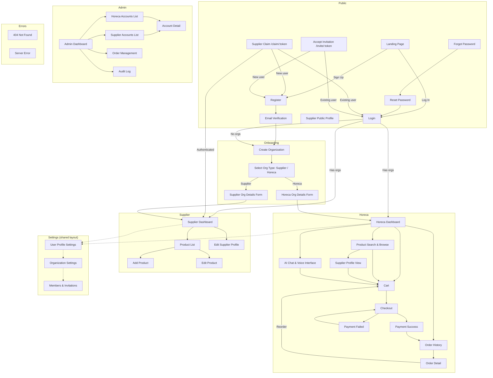

# Plexaris - Page Map

## Page Index

| #   | Page                    | Route                         | Role         | Source Doc |
| --- | ----------------------- | ----------------------------- | ------------ | ---------- |
| 1   | Landing                 | `/`                           | Public       | 00         |
| 2   | Login                   | `/login`                      | Public       | 01         |
| 3   | Register                | `/register`                   | Public       | 01         |
| 4   | Email Verification      | `/verify-email`               | Public       | 01         |
| 5   | Forgot Password         | `/forgot-password`            | Public       | 01         |
| 6   | Reset Password          | `/reset-password/:token`      | Public       | 01         |
| 7   | Supplier Claim          | `/claim/:token`               | Public       | 03         |
| 8   | Accept Invitation       | `/invite/:token`              | Public       | 01         |
| 9   | Supplier Public Profile | `/suppliers/:slug`            | Public       | 03         |
| 10  | Create Organization     | `/onboarding`                 | Auth         | 01         |
| 11  | Select Org Type         | `/onboarding/type`            | Auth         | 01         |
| 12  | Horeca Org Form         | `/onboarding/horeca`          | Auth         | 01         |
| 13  | Supplier Org Form       | `/onboarding/supplier`        | Auth         | 01         |
| 14  | Horeca Dashboard        | `/dashboard`                  | Horeca       | 07         |
| 15  | Product Search          | `/search`                     | Horeca       | 04         |
| 16  | Supplier Profile View   | `/suppliers/:slug`            | Horeca       | 03, 04     |
| 17  | AI Chat                 | `/chat`                       | Horeca       | 05         |
| 18  | Cart                    | `/cart`                       | Horeca       | 06         |
| 19  | Checkout                | `/checkout`                   | Horeca       | 06         |
| 20  | Payment Success         | `/checkout/success`           | Horeca       | 06         |
| 21  | Payment Failed          | `/checkout/failed`            | Horeca       | 06         |
| 22  | Order History           | `/orders`                     | Horeca       | 07         |
| 23  | Order Detail            | `/orders/:id`                 | Horeca       | 07         |
| 24  | Supplier Dashboard      | `/supplier/dashboard`         | Supplier     | 03, 04     |
| 25  | Product List            | `/supplier/products`          | Supplier     | 04         |
| 26  | Add Product             | `/supplier/products/new`      | Supplier     | 04         |
| 27  | Edit Product            | `/supplier/products/:id/edit` | Supplier     | 04         |
| 28  | Edit Supplier Profile   | `/supplier/profile`           | Supplier     | 03         |
| 29  | User Profile Settings   | `/settings/profile`           | Auth         | 01         |
| 30  | Organization Settings   | `/settings/organization`      | Auth         | 01         |
| 31  | Members & Invitations   | `/settings/members`           | Auth (owner) | 01         |
| 32  | Admin Dashboard         | `/admin`                      | Admin        | 08         |
| 33  | Horeca Accounts         | `/admin/horeca`               | Admin        | 08         |
| 34  | Supplier Accounts       | `/admin/suppliers`            | Admin        | 08         |
| 35  | Account Detail          | `/admin/accounts/:id`         | Admin        | 08         |
| 36  | Admin Order Management  | `/admin/orders`               | Admin        | 08         |
| 37  | Audit Log               | `/admin/audit-log`            | Admin        | 08         |
| 38  | 404 Not Found           | `*`                           | All          | --         |
| 39  | Server Error            | `/error`                      | All          | --         |
